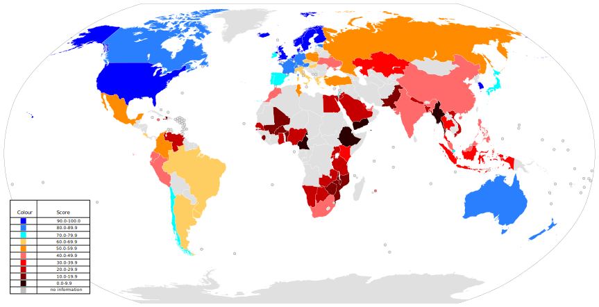

Test repo
---------

**strong**

*simple emphasis*

`source code`

~~strike through~~

_this emphasis_

__this emphasis__

_**`together`**_


Newlines
are
ignored

Force a line break with  
two spaces in the end of the line

or with \
in the end of the line

or with <br/> anywhere

Links
-----

- You can insert links in text like [this](/tutorial.md)

- You may add a [title](https://agea.github.io/tutorial.md "Markdown Tutorial") to your link (can you see the tooltip?)

- If your link contains spaces you have to write the [link](<http://example.com/a space>) between `<>`

- You can use spaces and markup inside the [link **text**](https://agea.github.io/tutorial.md)

- Long links may decrease source readability, so it's posible to define all links somewhere in the document (the end is a good place) and just reference the [link][tutorial.md], you may also collapse the reference if it matches the link text (example:  [tutorial.md][])

- You may also write directly the link: <https://agea.github.io/tutorial.md>

- It will work also for email addresses: <email@example.com> (you may write vaild email links also using [mailto](mailto:email@example.com) as protocol)


[tutorial.md]: https://agea.github.io/tutorial.md


Images
------

Syntax for images is like the syntax for links, but with a `!` before:





Lists
-----

To define a list of items, just put a `*`, a `-`, or a `+` at the start of the line of each item of the list followed by at least a space, to end the list, leave a blank line

* red
* green
* blue

- white
- grey
- black
+ yellow
+ pink
+ orange

You can also define numbered list, putting a number followed by a `.` or a `)` and a space at the start of the line (you may use any number, the first one is taken to start counting, then it will increment by one):
 
3.
2. you may leave blank items
1) or start
1) again

You can insert any block inside a list, you have to respect the indentation of the text of the list item

- A *paragraph* of text
  (spanning multiple lines),
  
  ```
  fenced code,
  ```
   
      indented code (4 spaces + 2 spaces for the list 
      indentation, one blank line above, one below),

  > quotes,
   
  - another 
    * list
      + (and so on...),
      
  - ### or headers


  Headers
-------

There are two ways to define headers:

The biggest possible header
===========================

# You can also use this markup

(I prefer the first one as it's more readable when looking directly at the source code)
 
A sub heading
-------------
 
## This is the alternative format

### Then you can go smaller

#### And smaller

##### And even smaller

###### No, you can't go smaller than this

The good thing is that many tools that convert Markdown in HTML or PDF are able to generate the index of your document, or links to the headers automatically (like Github does on the [source](http://git.io/vfz98) of Markdown files)


Horizontal rules
----------------

You can use horizontal rules to separate paragraphs: you may use three or more `*`
******
or three or more `_` (you may insert spaces before, after or between the characters, no other charachters are allowed)
__ __ __ __ 

or three (or more) `-` 

---

but you have to be careful as it is similar to the header syntax, so if you write `---` immediatly after a single line of text you get an header, either you have to leave a blank line before the `---`, or you put it after multiple lines of text


Source code
-----------

If you have to insert code in your document you have tree choiches:

 1. inline code like this: `*Hello* **world!**"`
 2. fenced code blocks (you may use ` ``` ` or `~~~` 
   as delimiters): 
``` markdown
*Hello* **world!**
```
 3. indented code blocks


    *Hello* 
    
    **world!**

You need to leave a blank linke after a paragraph and 2 blank lines after a list to start an indented code block (if you want the code to be out of the list), and you may insert the name of the language immediatly after the opening code fence (so some renderers may be able to highlight the syntax of the language)


Code and Syntax Highlighting
----------------------------

Code blocks are part of the Markdown spec, but syntax highlighting isn't. However, many renderers -- like Github's and Markdown Here -- support syntax highlighting. Which languages are supported and how those language names should be written will vary from renderer to renderer. Markdown Here supports highlighting for dozens of languages (and not-really-languages, like diffs and HTTP headers); to see the complete list, and how to write the language names, see the highlight.js demo page.

Inline `code` has `back-ticks around` it.
Inline code has back-ticks around it.

Blocks of code are either fenced by lines with three back-ticks ```, or are indented with four spaces. I recommend only using the fenced code blocks -- they're easier and only they support syntax highlighting.

```javascript
var s = "JavaScript syntax highlighting";
alert(s);
```
 
```python
s = "Python syntax highlighting"
print s
```
 
```
No language indicated, so no syntax highlighting. 
But let's throw in a <b>tag</b>.
```
var s = "JavaScript syntax highlighting";
alert(s);
s = "Python syntax highlighting"
print s
No language indicated, so no syntax highlighting in Markdown Here (varies on Github). 
But let's throw in a <b>tag</b>.

Blockquotes
-----------

> In this way you define a quoted block of text.
You can skip the initial `>` in intermediate lines 
if you are in the same paragraph
>
>> (you may nest levels)

    > but you can't indent with more than 3 spaces


HTML
----

Text between `<` and `>` that looks like an HTML tag is parsed as a raw HTML tag and will be rendered in HTML

While it may be useful when writing online content, please note that your tag may be stripped for security reasons and in output other than HTML you may have unexpected results

<p class="text-right">Look I'm right!</p>

This is the list of allowed html tags (case insensitive):

`article`, `header`, `aside`, `hgroup`, `blockquote`, `hr`, `iframe`, `body`, `li`, `map`, `button`, `object`, `canvas`, `ol`,`caption`, `output`, `col`, `p`, `colgroup`, `pre`, `dd`, `progress`, `div`, `section`, `dl`,`table`, `td`, `dt`, `tbody`, `embed`,`textarea`, `fieldset`, `tfoot`, `figcaption`, `th`, `figure`, `thead`, `footer`, `tr`, `form`, `ul`, `h1`, `h2`, `h3`, `h4`, `h5`, `h6`, `video`, `script`, `style`


Entities
--------

With the goal of making Markdown as HTML-agnostic as possible, all [valid HTML entities][] are recognized and converted into unicode characters

Named entities consist of `&` + any of the valid HTML5 entity names + `;` 

Some examples:

- `&amp;` &amp; 
- `&copy;` &copy;
- `&rarr;` &rarr;

[valid HTML entities] (https://html.spec.whatwg.org/multipage/entities.json)


Escaping
--------

If you have to write something that would result in a Markdown vaild syntax, you can escape the first character of your expression (you may also escape any other punctuation character) with a `\`

\*not emphasized\*

\<br/> not a tag

\[not a link](/foo)

\`not code`

1\. not a list

\* not a list

\# not a header

\[foo]: /url "not a reference"

You may also escape the backslash itself \\*like this*


About
-----

You can read the [Wikipedia](http://en.wikipedia.org/wiki/Markdown) article, if you want more information about Markdown.

There are several Markdown *flavours*, this tutorial is based on the [Commonmark](http://commonmark.org) specification.

You may want to read the full [Commonmark specification](http://spec.commonmark.org/)

The source code for this tutorial is on [Github](https://github.com/agea/tutorial.md)

### License

MIT - <http://www.opensource.org/licenses/mit-license.php>